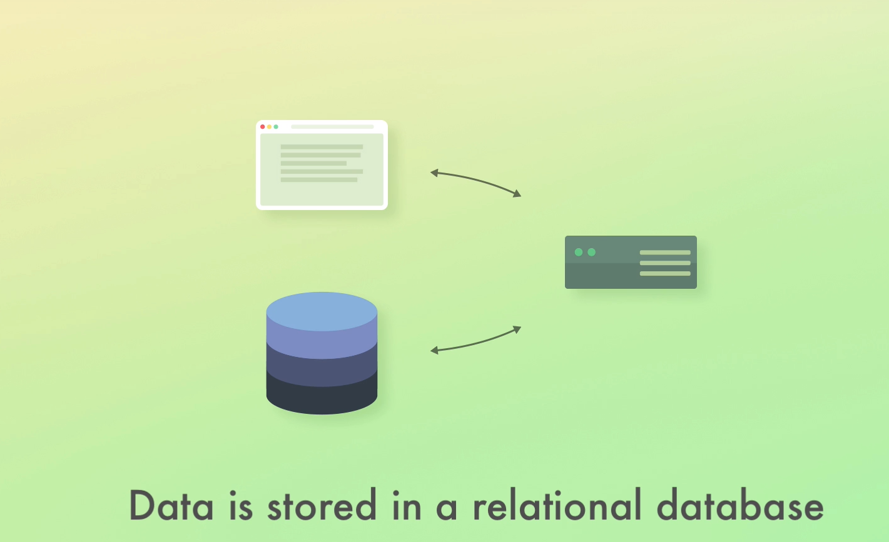

# Elastic Stack Udemy Course Notes

| Action                 | Date    |
| ---------------------- | ------- |
| Started Course         | 8/29/22 |
| Completed Lectures 1-X | 8/29/22 |

## Lecture 3: Elastic Stack:

-   **Elastic Search**
-   **Kibana**
-   **Logstash**: A data processing pipeline. It receives events, processes/filters them, and sends them to one or more platforms. Defined in a proprietary markup language.
-   **X-Pack**: Adds additional features to the Elasticsearch & kibana. The most important of these features include:
    -   **Security**: Adds authentication and authorization to elasticsearch and kibana. Controls user permissions. Different people might need different privileges.
    -   **Monitoring**: Gain insight into how the elastic stack is running.
    -   **Alerting**: Check if CPU usage is too high, or errors starting propagating.
    -   **Reporting**
    -   **Machine Learning**: Abnormality Detection, Forecasting, etc...
    -   **Graphs**: Analyses relationships between data.
    -   **SQL**: Elasticsearch queries are written in Query DSL. It is flexible but verbose.
-   **Beats**

### Summary of Elastic Stack

The center of it all is elastic search, which contains the data. Injecting data into elastic search can be done with **beats** or **elastic stash**, as well as through elasticsearch's api. **Kibana** is a UI that sits on top of elasticsearch to let you visualize the data that you receive. **X-pack** enables additional features such as ML.

ELK Stack = `E`lasticsearch + `L`ogstash + `K`ibana
This term originates from before X-pack existed. The `elastic stack` is a superset of the `ELK` stack.

## Lecture 4: Walk-through of common architectures

Suppose we have an E-commerce app.  Our data is stored in a relational db such as postgres.

